# Sa_displacedge パイプライン解説

`prototype/preview.py`(NumPy参照実装)を実際の写真(`docs/pipeline_examples/00_input.png`, 1920x1440, ユーザー提供)に適用した結果です。GPU/Direct2D無しで、`ymm/Shaders/*.hlsl`と同じ式を検証・確認するためのものです。実装ファイルとの対応は[`ymm/README.md`](../ymm/README.md)を参照してください。

## 1. 全体の流れ

```mermaid
flowchart TD
    SRC["元画像 (sRGB)"] --> LUMA["OKLab L抽出"]
    LUMA --> GRAD["Scharr勾配<br/>(検出サイズ間隔)"]
    GRAD --> BLUR["三重ボックスブラー<br/>(変位範囲=sigma)"]
    BLUR --> MASK["しきい値 + コントラスト<br/>→ 強さマスク mask"]
    BLUR --> NORMAL["平均勾配方向<br/>edgeNormal"]

    SEED["座標 + シード + 時間"] --> CURL["カール・ノイズ<br/>(発散ゼロ, 回転オクターブfBm)"]

    NORMAL --> FLOWMIX["乱流で線形補間"]
    CURL --> FLOWMIX
    FLOWMIX --> FLOW["正規化した流れベクトル"]
    MASK --> DISP["変位 = 流れ × 変位強度 × mask"]
    FLOW --> DISP

    SRC --> SAMPLE["元画像をR/G/B別オフセットで再サンプリング<br/>(色収差)"]
    DISP --> SAMPLE
    NORMAL --> GLINT["リムライト × 虹色パレット<br/>(虹色の強さ)"]
    DISP --> GLINT
    SAMPLE --> OUT["合成"]
    GLINT --> OUT
```



## 2. 既定パラメータでの見た目

| 元画像 | 合成(既定値) |
|---|---|
|  |  |

輪郭(髪の生え際・服の縁・遠景の屋根の輪郭など)に沿って画素が渦状にずれ、プリズムのような色収差の縁取りと虹色のきらめきが乗っています。平坦な空や強くぼかされた背景はしきい値以下のため、ほぼ元のまま残ります。

## 3. パラメータの効き方

### 3-1. 弱め(`--strength 18 --turbulence 0.25 --dispersion 0.15 --iridescence 0.3`)

輪郭の外向き方向が支配的になり(乱流25%)、変位も色収差も控えめなので、輪郭がわずかに滲んで薄く色づく程度の上品な効果になります。


### 3-2. 強め(`--strength 70 --turbulence 0.9 --dispersion 0.5 --iridescence 0.8 --radius 64`)

渦ノイズが支配的になり(乱流90%)、輪郭が液体ガラスのように大きく渦を巻いて溶け、強い色収差と虹色のきらめきが加わります。


### 3-3. デバッグ出力

**強さマスク**(`--mode mask`): しきい値・コントラスト・ぼかし後の「どれだけ変位させるか」を0(黒)〜1(白)で可視化したものです。輪郭に近いほど白くなります。


**流れの向き**(`--mode flow`): 最終的な流れベクトルをR=x成分、G=y成分、B=マスクとして可視化したものです。輪郭の外向き方向と渦ノイズが混ざった結果の「どちらへ変位させるか」が色相として見えます。


## 4. なぜこの組み合わせが既存のものと違うか

- **変位マップ**単体は、静的なテクスチャやノイズでUVをずらすだけで、画像自体の輪郭とは無関係なことが多い。Sa_displacedgeは輪郭検出結果(どこに、どちらに変位させるか)を流れ場の一部として使うため、被写体の形に沿った変位になる。
- **色収差**単体は、画面全体に一様にRGBをずらすことが多い。Sa_displacedgeは変位マスクで重み付けするため、輪郭付近にだけプリズム効果が現れる。
- **グリッチ**系エフェクトは矩形ブロックや走査線のずれが主体で、連続的な流体感はない。Sa_displacedgeは発散ゼロのカール・ノイズを使うため、破れたり不連続に飛んだりせず、渦を巻きながら連続的に流れる。
- 3つを輪郭検出→発散ゼロの流れ場→色収差・虹色ハイライトという一本のパイプラインにまとめている点が、既存の単機能プラグインの組み合わせでは得にくい見た目を作っています。

## 5. 再現方法

```bash
pip install numpy pillow
python prototype/preview.py docs/pipeline_examples/00_input.png out.png
python prototype/preview.py docs/pipeline_examples/00_input.png out_calm.png --strength 18 --turbulence 0.25 --dispersion 0.15 --iridescence 0.3
python prototype/preview.py docs/pipeline_examples/00_input.png out_wild.png --strength 70 --turbulence 0.9 --dispersion 0.5 --iridescence 0.8 --radius 64
python prototype/preview.py docs/pipeline_examples/00_input.png out_mask.png --mode mask
python prototype/preview.py docs/pipeline_examples/00_input.png out_flow.png --mode flow
```
